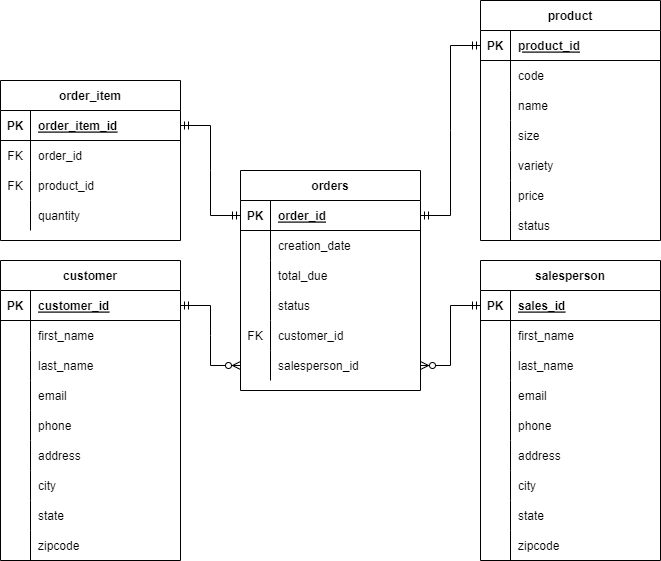

# Introduction
The purpose of the JDBC (Java Database Connectivity) application was to create a CRUD Java program using the Maven framework that takes customer information and enters it into a database as well as to be able to retrive the data. This was done using PostgreSQL running inside a docker container.

#### Tools that were used:

&nbsp;

&nbsp;
&nbsp;
&nbsp;
&nbsp;
&nbsp;

# Implementaiton
## ER Diagram

## Design Patterns
#### DAO design pattern
The design of the `DAO pattern` was implemented within the CustomerDAO class. This pattern was used to define a interface that provides access to an underlying database. This iis used to seperate the database and the application. 

#### Repistory pattern
The `repository pattern` searches for a specific object type in the database one at a time (DB persistence) and stores the object. 

# Test
The testing for my JDBC application was done manually. The database was first setup in PostgreSQL and run within a Docker container. I then fed the sample data to the database in order to populate it for the tests. I tested my app against the database in the `SQL` folder using the JDBCExecuter class to run all of the CRUD operations and compare the results with the expected output.

