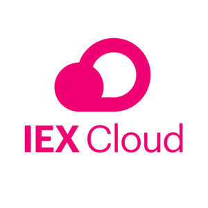
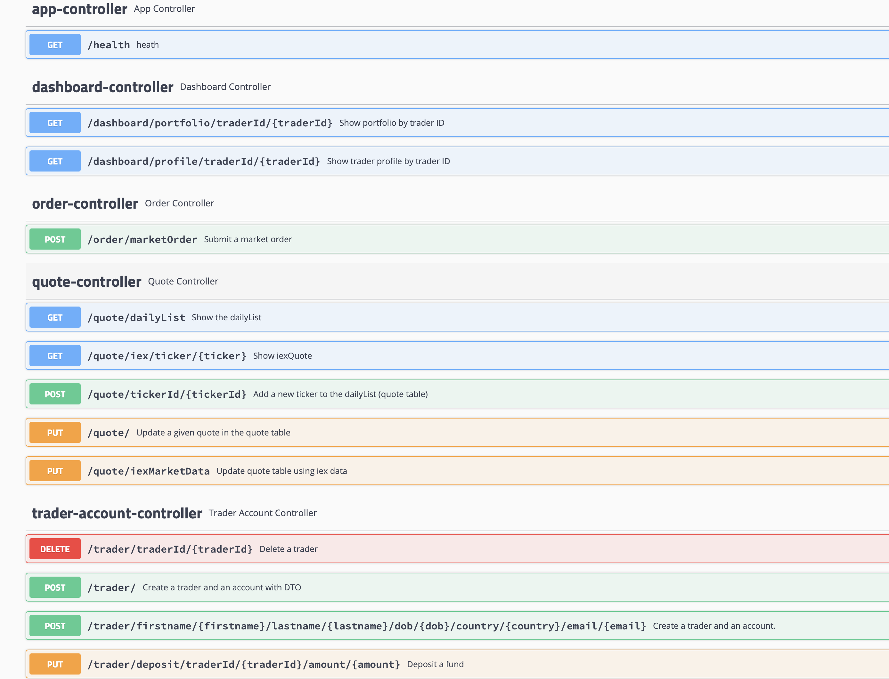

# Springboot Trading Application
* [Introduction](#Introduction)
* [Quick Start](#QuickStart)
* [Implemenation](#Implemenation)
* [Test](#Test)
* [Deployment](#Deployment)
* [Improvements](#Improvements)

# Introduction
#### Business Context of Application:
This project arose from the Jarvis trading team who wanted to develop a brand new trading platform to replace their outdated legacy system (hard to manage and scale). I was tasked with developing the backend of the application with the Springboot framework and the microservice architecture (DAO, Controller, Service, Database...). This is a POC (proof of concept) application, if it is deemed to be successful Jarvis will invest more money into the project.

#### Features and Functionalities of the SpringBoot Trading Application:
The trading application uses IEX cloud as the API data source, Some of the features include:
- Users can create and store traders, accounts, quotes, and security orders into the PSQL database.
- Users can execute buy and sell orders of different Stocks on the Market using clients' accounts 

#### Technologies used:
This Application is built using Java 8, the Microservice MVC architecture along with the Springboot framework, IEX Cloud REST API, PostgreSQL database, and deployed using Docker containers.

# Quick Start
  #### Prequiresites: 
  * `Docker`
  * `CentOS 7`
  * `Java 8`
  * `Maven`
  * `SpringBoot`
  * `IEX Cloud` (public api token)
  * `Swagger` or `Postman`
  
   
  
  
  
  
  
  
  

#### Docker scripts with description

- The first step is to create a IEX Cloud Account at https://iexcloud.io/, then setup an environmental variable with the public API Token <br />
```export IEX_PUB_TOKEN="Insert your API Token here"```

###### 1. Make sure docker is installed and up-to date 
``` 
#Docker 17.05 or higher
docker -v

#install latest docker if your docker version is old
sudo yum remove -y docker \
                  docker-client \
                  docker-client-latest \
                  docker-common \
                  docker-latest \
                  docker-latest-logrotate \
                  docker-logrotate \
                  docker-engine

sudo yum install -y yum-utils device-mapper-persistent-data lvm2

sudo yum-config-manager \
    --add-repo \
    https://download.docker.com/linux/centos/docker-ce.repo

sudo yum -y install docker-ce docker-ce-cli containerd.io

#auto start
#sudo systemctl enable docker
#start service
sudo systemctl start docker && sudo docker -v 
```
###### 2. build Docker images for the application and the Database 

```
  cd ./springboot/psql
  docker build -t trading-psl .
  cd ./springboot
  docker build -t trading-app .
```

###### 3. create a docker network
  - start containers
```
#verify docker network
docker network ls

#start a docker container
#attached the container to the trading-net network
docker run --name trading-psql-dev \
-e POSTGRES_PASSWORD=password \
-e POSTGRES_DB=jrvstrading \
-e POSTGRES_USER=postgres \
--network trading-net \
-d -p 5432:5432 trading-psql

#verify
docker ps

#set IEX credential
IEX_PUB_TOKEN="your token here"
#start trading-app container which is attached to the trading-net docker network
docker run --name trading-app-dev \
-e "PSQL_URL=jdbc:postgresql://trading-psql-dev:5432/jrvstrading" \
-e "PSQL_USER=postgres" \
-e "PSQL_PASSWORD=password" \
-e "IEX_PUB_TOKEN=${IEX_PUB_TOKEN}" \
--network trading-net \
-p 5000:5000 -t trading-app

```
###### 4. list running containers
```
# you should see two running docker containers
docker container ls
```
###### 5. Try trading-app with SwaggerUI (screenshot)


# Implemenation
## Architecture
  - **Controller layer:** The control layer handles all of the HTTP requests, the Web Servlet then maps each request to the appropriate service class.
  - **Service layer:** The service layer handles all of the business logic, an example would be it only processes an order if it isn't null/empty.
  - **DAO layer:** The DAO layer is responsible for persisting and retrieving data from the PostgreSQL database.
  - **SpringBoot:** SprinBoot is a free and open-source framework that uses features from Spring MVC (IOC), it allows for automatic configurations and an embedded tomcat server.
  - **PSQL/Database Layer:** The database layer built on PostgreSQL is responsible for storing the data of the application in tables.
  - **IEX Cloud:** IEX Cloud is an API that provides the application with stock market and financial data.

## REST API Usage
### Swagger
Swagger UI allows anyone — be it your development team or your end consumers — to visualize and interact with the API’s resources without having any of the implementation logic in place. It’s automatically generated from your OpenAPI (formerly known as Swagger) Specification, with the visual documentation making it easy for back-end implementation and client-side consumption.  To run or consume the application, navigate through ```http://localhost:8080/swagger-ui.html#/```
### Quote Controller
- [GET] `/quote/dailyList`
  - lists all securities that are available for trading in this trading system.
- [GET] `/quote/iex/ticker/{ticker}`
  - Shows the specified ticket from the IEX Cloud Rest API
- [POST] `/quote/tickerId/{tickerId}`
  - Adds a new ticker to the dailyList
- [PUT] `/quote/` 
  - Updates a quote in the quote table
- [PUT] `/quote/iexMarketData`
  - Fetches quotes from IEX and updates all quotes from the quote table
### Trader Controller
- [POST] `trader/*` createTrader
    - Two endpoints can create a new trader. The first will allows you to create a new trader using the HTTP request body, and the other one allows you to use a URL.
    - Create a new trader (Note: `dob` format yyyy-mm-dd)
- [PUT] `/trader/deposit/*` deposit fund
    - deposit $1M dollar to the user you just created
    - deposit $-1 dollar should fail with 400 status code
- [PUT] `/trader/withdraw/*` withdraw fund
    - Withdraw $999,000. The new balance is $1000
    - Withdraw $1001 should fail with 400 status code (insufficient fund)
- [DELETE] `/trader/traderId/{traderId}` deleteTrader
### Order Controller
- [POST] `/order/marketOrder`
  - Execute a market order endpoint
  - Buy stocks
### Dashboard controller
- [GET] `/dashboard/portfolio/traderId/{traderId}` 
  - Show portfolio by trader ID
- [GET] `/dashboard/profile/traderId/{traderId}` 
  - Show trader profile by trader ID
# Test 
I tested the SpringBoot Trading Application using Junit4 to create both Unit and Integration test cases. I also used Swagger and Postman to test all of the REST endpoints. The line coverage is over 50%.

# Deployment


Docker is used to deploy the application, the diagram above shows all of the back-end workings of the docker deployment. As you can see the Docker host contains the two containers that we created using images retrieved from the Docker Hub:

```trading-psql-dev:``` The trading-psql-dev container is created using the Postgre image from the Docker Hub for initializing the database.

```trading-app-dev``` The trading-app-dev container is created using the maven:3.6-jdk-8-slim to compile and package your source code using Maven and openjdk:9.6-alpine image to start the Java App.

# Improvements
- Integrate a UI to make the application easier to use and more appealing 
- Fully fletch out the application so that every part of the IEX Cloud REST API can be used
- Have a login screen and have users able to log in using their encrypted credentials
- Have a portfolio of all of the transactions for each user so they can monitor their trading activity
